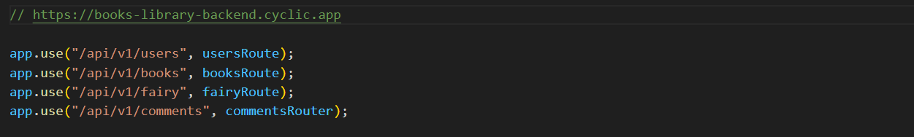
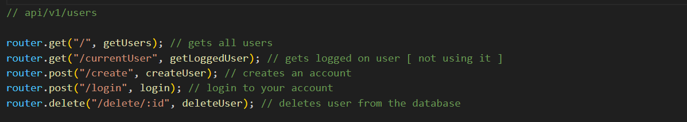
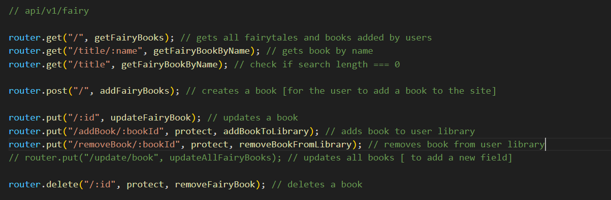
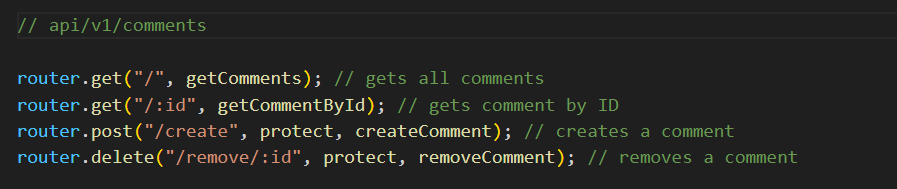

# Book Library Backend

I have created a responsive book library using React for the frontend and MongoDB for the backend.

### Links

- Backend: https://books-library-backend.cyclic.app/api/v1/books
- Frontend: https://books-library.netlify.app/
- Frontend github: https://github.com/HasanOmar1/Books-library-frontend

---

### Used packages

- Mongoose
- Express
- Dotenv
- Cors
- Bcrypt
- JWT Token
- Puppeteer

---

## About

- There are four schemas. [User , Books , FairyTales , Comments]
- There are authorization tokens for each user.
- There is an error middleware.
- I used puppeteer locally because i couldn't deploy my backend with it. [puppeteer.js shows the work]

---

### Endpoints

- https://books-library-backend.cyclic.app

- Routes
  

- Users
  

- Books
  

- FairyTales
  

- Comments
  
